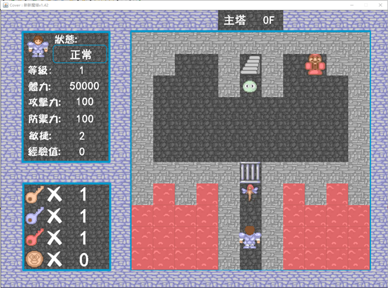
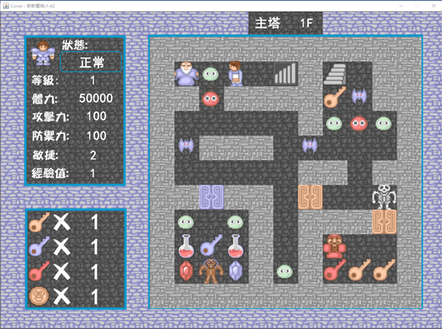
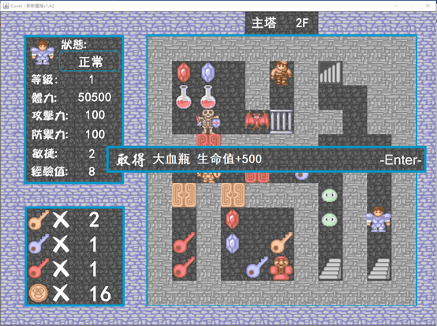
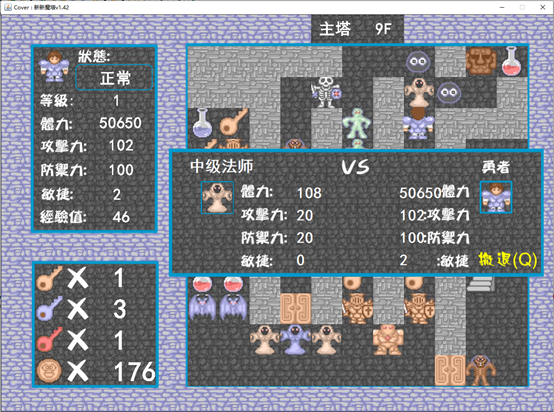
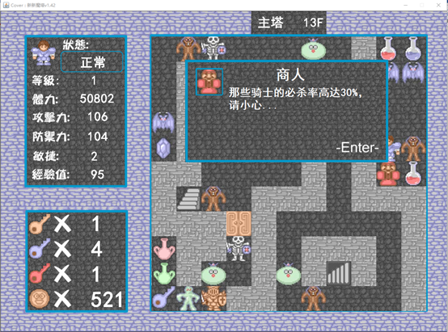
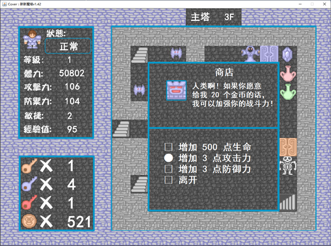
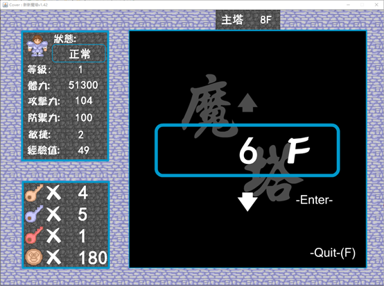
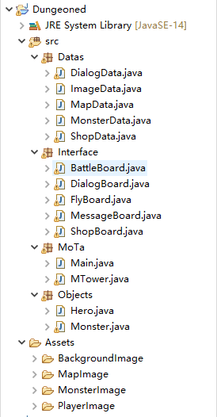
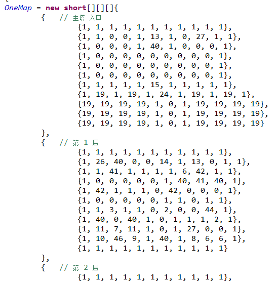
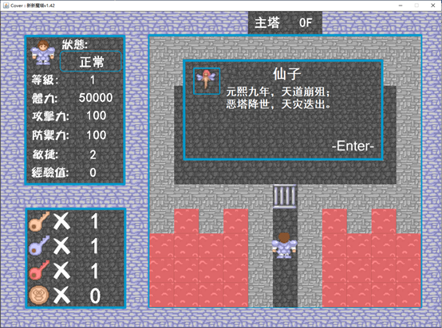

（注：本repo为2020秋季学期《Java程序设计》课程作业。2022.03修订文档部分，内容摘自作业附加的说明文档）

## 一、项目简介

本项目基于新新魔塔v1.42为设计模板，几乎完整的复刻了魔塔的全部功能（仅怪物伤害预测功能因时间有限与一些技术困境暂未制作），完整地还原了0-20层的地图数据、怪物数据、道具拾取数据、NPC对话数据、商店购买数据。因原版魔塔工作量过于庞大，因此删减了原版新新魔塔v1.42的地下25F部分，但是以目前的技术手段是可以做到完整实现地下部分的，并重构了结束剧情。开始时，整体界面图如下：

正常版本下，英雄的初始体力应为1000，攻击、防御均为10，此处进行了“无敌化”修改，以降低游戏策略难度，使得可以较好地体验到完整游戏内容。接下来的部分将详细介绍各个功能。

项目整体代码量约2850行。在整体架构与图片素材上参考了[此项目](https://github.com/gdut-yy/MagicTower)，关卡设计与灵感则来源于[此网页游戏](http://www.17yy.com/f/play/58780.html)。

## 二、功能介绍

### 1、基础操控

使用键盘的上、下、左、右键可操作英雄向相应方向移动，且人物面朝的方向也会相应改变，根据该方向接下来的不同物体种类会产生不同的相应，如遇到墙壁无变化，遇到道具会进行拾取，遇到怪物进行战斗，遇到NPC与之对话等等。

此外，在第8层与老人NPC对话并获取道具后，可解锁楼层飞行功能，此后，按“F”键可进入楼层飞行界面。主要的键盘操作即为以上部分，无鼠标操作内容。

### 2、道具拾取

对于3种不同颜色的钥匙、攻击/防御宝石、血瓶等常见道具，仅会在第一次拾取时弹出如上图所示的提示框，但对于剑、盾、升级羽毛、圣水瓶等物品，每次拾取均会会详细介绍效果。拾取道具并弹出提示框后，英雄移动的操作将被锁定，无法操控上下左右键，按“回车”键可返回主面板。

### 3、怪物战斗

上图为怪物战斗界面一例，面板中会展示英雄的多个信息与怪物的相关属性，每隔一段时间，会模拟自动进行一次攻击，如勇者攻击怪物让其损失一定血量，之后怪物攻击勇者，如是循环。

当怪物血量降为零后，将结算为战斗胜利，更新地图信息并获得相应的怪物掉落品，多数情况为金币与经验。

此外，若感觉怪物过于强大，战斗时可按“Q”键暂时撤退，磨砺自身能力后再图一战。

### 4、NPC对话

与NPC接触后，分为纯对话类NPC与交互类NPC两种，后者多为商店、交易等场景。与非交互类的NPC对话会弹出如上图所示的对话框，其中许多交谈信息对于闯塔有着很高的价值，或者可用于获取指定道具等（如与8F老人对话解锁楼层飞行功能）。

### 5、NPC交互

商店类NPC的界面可进行交互，如上图为消耗金币获取能力，使用上、下键可操作当前选项移动，以白色实心圆圈标识，按“回车”键可确认购买，若离开该NPC交互界面，需移动到“离开”选项并回车。

### 6、楼层飞行

与8F的老人对话后，可解锁楼层飞行功能，除特殊楼层外（如10F、20F），在主界面按“F”键可唤出上图所示界面。上、下键用于选择到达楼层，最高只能到达目前已抵达的最高楼层，“回车”键确认，“F”键退出该功能界面。

## 三、代码说明

### 1、总览

根目录分为src与Assets两部分，src中主要为核心代码，Assets中为原始图片素材。

Src文件夹中包含四个主要部分：

1. Datas中存储各种类型的数据，自上至下依次是对话数据、图片数据（读取图片）、地图数据、怪物数据、商店购买数据。
2. Interface中为各个界面的类，自上至下依次是战斗界面、对话框界面、楼层飞行界面、提示信息界面、商店界面。但这一部分并不完全都是界面部分的代码，其中很多内容与机制实现等杂糅在一起，如战斗中的血量损失、暴击、闪避等函数，以在类的定义内部函数等方式实现。
3. MoTa是最核心的部分。Main函数引入了全部类，加入了各种界面面板，并定义几种键盘操作的KeyListener。MTower绘制了主界面面板，同时定义了核心交互函数，即根据英雄触碰到的物体的不同id触发不同效果。
4. Objects定义了英雄与怪物两个类，定义血量、攻击、防御、钥匙、金币等属性。

### 2、英雄与怪物

Hero类定义了英雄的基础属性，包括：状态、生命值、攻击力、防御力、敏捷、金币、经验、暴击、钥匙、等级、位置、朝向。并包含每个属性的获取、设定、增减相关的函数，因涉及变量较多，此部分共有324行。

类似地，Monster类定义了怪物的属性，包括：序号、名称、生命值、攻击力、防御力、敏捷、掉落金币、掉落经验、状态。以及获取上述属性的函数，此部分共69行。

MonsterData类中采用HashMap的形式存储了全部约30种怪物的详细数据，这一部分工作量较大，每条数据都是一边开着网页版魔塔游戏，一边人工读取并填写上的，共56行。

### 3、地图与物品

MapData类中包含了魔塔全部22层的地图数据，采用三维数组的方式存储于OneMap中，地图中的每个物体、怪物、道具、NPC均有唯一id编号，将该id编号填写在数组相应位置中，每层为11×11的矩阵，这一部分共353行。

具体示例如下：

地图这一部分的工作量非常非常非常之大，虽然所占总体行数不多，但全部22层的每一格的物体id数据都是本人手工录入的，观察网页版魔塔游戏的地图，一一对应地匹配相应物体，并转换为特定id写在数组中。前面几层还需不断查看物体与id对应表，后面的层数录入时甚至可以对某一物体的id倒背如流。同时需不断调试避免物体绘制错误，牵涉精力也非常多。

### 4、图片

ImageData类采用HashMap读取并存储了各种可能会用到的图片，包括各个界面的背景图、英雄图、怪物图、道具图、NPC图等等。以主界面为例，每一层魔塔其数据存储形式是11×11的整数型二维矩阵，需要将其翻译到对应图片并在指定位置绘制出来。其他的各种界面也是同理，都需要从ImageData类中读入对应图片。此部分168行。

另外，除了来源于所引用项目中的图片素材外，几乎全部背景图片、源素材缺失的道具或怪物图片，均是人工使用微信截图并用PS后期处理得到的，之后再配上程序中的文字显示，不断调整位置，工作量也非常大。

### 5、文案与对话

DialogData类中存储了全部魔塔中涉及到的对话，设置了相关获取对话信息的函数，根据当前NPC的id、所在层数、对话次数等信息获取字符串组。此部分共343行。

这部分的所有对话内容均为依照网页版魔塔原封不动地迁移过来的，纯手打无添加，工作量也较大。值得一提的是，原魔塔版本的开局对话过于简略，缺少背景介绍与引导。因此本人还亲自撰写了160字的打油组诗一首作为开局的背景介绍。

见下图：

### 6、战斗

在MTower类中，当目标物体id为40-70及28（且为20F）、198时，将触发战斗事件，弹出战斗面板。战斗机制部分写在了BattleBoard类中，实现较为简单，就是攻击力-防御力，但也加入了暴击与闪避的判断，英雄与怪物的敏捷会影响闪避率。

### 7、NPC交互

首先遇见NPC时，先进行交互种类的判断，分为对话与商店两种。

对话类NPC只需弹出对话框，从DialogData类中读取对话文字并展示，这里考虑到对话框大小有限，加入了对话内容分为多个页面的方式，分段展示全部对话内容，按“回车”键相当于跳到下一部分。

商店类NPC仍从DialogData类中读取商品介绍等文字信息，商品结算信息则保存在ShopData类中（如20金币购买3点攻击力）。在商店界面加入KeyListener以使得可以上、下键以及“回车”键选择商品种类或退出，同时更新界面展示信息。

### 8、楼层飞行

此处的楼层转移只需修改当前所在层数与更新英雄新的位置，并重新绘制面板，另外由于本版本魔塔每层可能会有多个上楼或下楼口，跳转到的位置则是与上一次英雄上下楼时的记录一致。

## 四、代码量总结

<table>
   <tr>
       <td><b>所在目录</b></td>
      <td><b>类的名称</b></td>
      <td><b>代码行数</b></td>
      <td><b>小计</b></td>
      <td><b>总计</b></td>
   </tr>
   <tr>
      <td>Datas</td>
      <td>DialogData</td>
      <td>343</td>
      <td rowspan="5">1082</td>
      <td rowspan="14">2852</td>
   </tr>
   <tr>
      <td></td>
      <td>ImageData</td>
      <td>168</td>
   </tr>
   <tr>
      <td></td>
      <td>MapData</td>
      <td>353</td>
   </tr>
   <tr>
      <td></td>
      <td>MonsterData</td>
      <td>56</td>
   </tr>
   <tr>
      <td></td>
      <td>ShopData</td>
      <td>162</td>
   </tr>
   <tr>
      <td>Interface</td>
      <td>BattleBoard</td>
      <td>329</td>
      <td rowspan="5">862</td>
   </tr>
   <tr>
      <td></td>
      <td>DialogBoard</td>
      <td>127</td>
   </tr>
   <tr>
      <td></td>
      <td>FlyBoard</td>
      <td>132</td>
   </tr>
   <tr>
      <td></td>
      <td>MessageBoard</td>
      <td>88</td>
   </tr>
   <tr>
      <td></td>
      <td>ShopBoard</td>
      <td>186</td>
   </tr>
   <tr>
      <td>MoTa</td>
      <td>Main</td>
      <td>100</td>
      <td rowspan="2">515</td>
   </tr>
   <tr>
      <td></td>
      <td>MTower</td>
      <td>415</td>
   </tr>
   <tr>
      <td>Objects</td>
      <td>Hero</td>
      <td>324</td>
      <td rowspan="2">393</td>
   </tr>
   <tr>
      <td></td>
      <td>Monster</td>
      <td>69</td>
   </tr>
</table>

